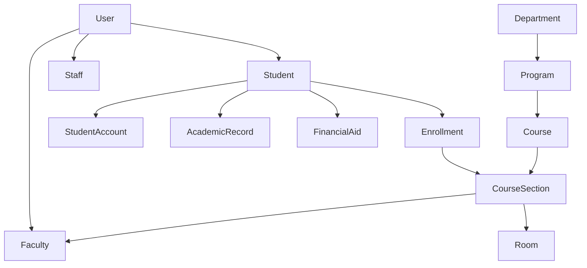

# Student Information System (SIS) - Complete Implementation Plan

## Executive Summary
A comprehensive, modern Student Information System serving all university stakeholders with real-time data, role-based access, and mobile-first responsive design. This plan outlines the architecture, features, and phased implementation approach for building an enterprise-grade SIS.

## 1. System Architecture Overview

### 1.1 Core Principles
- **Single Source of Truth**: Centralized data with consistent APIs
- **Role-Based Access Control (RBAC)**: Granular permissions per stakeholder
- **Real-Time Updates**: WebSocket/SSE for live data synchronization
- **Mobile-First Design**: Responsive across all devices
- **Modular Architecture**: Microservices-oriented with clear boundaries
- **Event-Driven**: Audit trails and notification system
- **Scalable**: Horizontal scaling with queue-based processing

### 1.2 Technology Stack
- **Backend**: Laravel 11 (API) + PostgreSQL + Redis + RabbitMQ
- **Frontend**: Next.js 15 + TypeScript + TanStack Query + Zustand
- **Real-time**: Pusher/Soketi (WebSockets) + Laravel Echo
- **Search**: Elasticsearch/Meilisearch
- **File Storage**: S3-compatible (MinIO/AWS S3)
- **Authentication**: Laravel Sanctum + 2FA + SSO (SAML/OAuth)
- **Monitoring**: Prometheus + Grafana + Sentry

## 2. Stakeholder Modules & Features

### 2.1 Student Portal
**Primary Users**: Current Students, Prospective Students

#### Core Features
- **Dashboard**: Personalized overview with alerts, deadlines, schedule
- **Course Management**
  - Browse catalog with smart filters
  - Shopping cart with prerequisite checking
  - Waitlist management with auto-enrollment
  - Schedule builder with conflict detection
  - Drop/Add with refund calculations
- **Academic Records**
  - Real-time grades and GPA
  - Unofficial transcripts (PDF generation)
  - Degree audit with progress tracking
  - Academic standing alerts
- **Financial Services**
  - Account summary with balance
  - Payment gateway integration
  - Payment plans and installments
  - Financial aid status and disbursements
  - 1098-T tax documents
- **Campus Life**
  - Housing applications and assignments
  - Meal plan management
  - Parking permits
  - Student organization memberships
- **Communication**
  - Secure messaging with faculty/staff
  - Announcement feed with filters
  - Calendar integration (iCal/Google)

#### Data Models
```typescript
interface Student {
  id: string
  userId: string
  studentNumber: string
  program: Program
  academicStanding: AcademicStanding
  enrollmentStatus: EnrollmentStatus
  financialHold: boolean
  advisors: Advisor[]
  cohort: string
  expectedGraduation: Date
}
```

### 2.2 Faculty Portal
**Primary Users**: Professors, Instructors, TAs

#### Core Features
- **Course Management**
  - Roster management with photos
  - Gradebook with weighted categories
  - Attendance tracking with patterns
  - Assignment creation and rubrics
  - Bulk grade upload (CSV/Excel)
- **Communication**
  - Class announcements
  - Individual student messaging
  - Office hours scheduling
  - Early alert system for at-risk students
- **Analytics**
  - Grade distribution charts
  - Attendance patterns
  - Assignment completion rates
  - Student performance trends
- **Administrative**
  - Textbook orders
  - Room change requests
  - Guest speaker management
  - Field trip coordination

#### Data Models
```typescript
interface Faculty {
  id: string
  userId: string
  employeeId: string
  department: Department
  rank: AcademicRank
  tenure: TenureStatus
  courses: CourseSection[]
  officeHours: OfficeHours[]
  committees: Committee[]
}
```

### 2.3 Advisor/Counselor Portal
**Primary Users**: Academic Advisors, Guidance Counselors

#### Core Features
- **Student Management**
  - Caseload dashboard with alerts
  - Comprehensive student profiles
  - Academic planning tools
  - Degree requirement mapping
  - What-if analysis for major changes
- **Intervention Tools**
  - Early alert notifications
  - Academic recovery plans
  - Study skill resources
  - Referral system (tutoring, counseling)
- **Communication**
  - Appointment scheduling
  - Video conferencing integration
  - Note-taking system (FERPA compliant)
  - Batch messaging for cohorts
- **Reporting**
  - Retention risk scores
  - Success predictors
  - Cohort analysis
  - Graduation projections

#### Data Models
```typescript
interface AdvisingSession {
  id: string
  advisorId: string
  studentId: string
  date: Date
  type: SessionType
  notes: EncryptedNote[]
  actionItems: ActionItem[]
  referrals: Referral[]
  followUpDate: Date
}
```

### 2.4 Registrar Portal
**Primary Users**: Registrar Staff, Records Officers

#### Core Features
- **Records Management**
  - Official transcript processing
  - Degree verification
  - Enrollment verification
  - Grade change workflows
  - Graduation clearance
- **Course & Schedule**
  - Master schedule builder
  - Room assignment optimization
  - Final exam scheduling
  - Course capacity management
- **Compliance**
  - FERPA management
  - Veterans certification
  - Athletic eligibility
  - International student reporting (SEVIS)
- **Reporting**
  - Enrollment statistics
  - Retention rates
  - Graduation rates
  - Federal reporting (IPEDS)

#### Data Models
```typescript
interface AcademicRecord {
  id: string
  studentId: string
  term: Term
  courses: CourseRecord[]
  gpa: GradePointAverage
  academicStanding: Standing
  honors: Honor[]
  sealed: boolean
  ferpaRestriction: boolean
}
```

### 2.5 Bursar/Finance Portal
**Primary Users**: Bursar Staff, Financial Services

#### Core Features
- **Student Accounts**
  - Account management dashboard
  - Billing statement generation
  - Payment processing and posting
  - Refund processing
  - Collections management
- **Financial Aid Integration**
  - Award letter generation
  - Disbursement scheduling
  - Satisfactory Academic Progress (SAP)
  - Return of Title IV (R2T4) calculations
- **Payment Plans**
  - Installment plan setup
  - Automatic payment scheduling
  - Late fee assessment
  - Payment reminder automation
- **Reporting**
  - Accounts receivable aging
  - Cash reconciliation
  - Revenue forecasting
  - Bad debt analysis

#### Data Models
```typescript
interface StudentAccount {
  id: string
  studentId: string
  balance: Money
  transactions: Transaction[]
  paymentPlan: PaymentPlan
  holds: FinancialHold[]
  authorizedPayers: AuthorizedPayer[]
  taxDocuments: TaxDocument[]
}
```

### 2.6 Admissions Portal
**Primary Users**: Admissions Officers, Recruiters

#### Core Features
- **Application Management**
  - Application review workflow
  - Committee review assignments
  - Decision letter generation
  - Waitlist management
  - Yield prediction models
- **Recruitment CRM**
  - Prospect management
  - Communication campaigns
  - Event management
  - Territory management
  - Conversion funnel analytics
- **Document Processing**
  - Transcript evaluation
  - Test score importing
  - Letter of recommendation tracking
  - Portfolio review system
- **Analytics**
  - Application trends
  - Demographic analysis
  - Yield rates by segment
  - Scholarship optimization

#### Data Models
```typescript
interface Application {
  id: string
  applicantId: string
  term: Term
  type: ApplicationType
  status: ApplicationStatus
  programs: ProgramChoice[]
  documents: Document[]
  reviews: Review[]
  decision: Decision
  scholarship: ScholarshipOffer
}
```

### 2.7 Department Head Portal
**Primary Users**: Department Chairs, Program Directors

#### Core Features
- **Academic Planning**
  - Curriculum management
  - Course scheduling
  - Faculty load balancing
  - Sabbatical planning
- **Resource Management**
  - Budget tracking
  - Space allocation
  - Equipment requests
  - Lab scheduling
- **Faculty Management**
  - Performance reviews
  - Teaching evaluations
  - Research tracking
  - Committee assignments
- **Student Success**
  - Major-specific analytics
  - Retention by program
  - Job placement tracking
  - Alumni outcomes

#### Data Models
```typescript
interface Department {
  id: string
  name: string
  code: string
  chair: Faculty
  faculty: Faculty[]
  programs: Program[]
  budget: Budget
  spaces: Space[]
  equipment: Equipment[]
}
```

### 2.8 Dean Portal
**Primary Users**: Academic Deans, Associate Deans

#### Core Features
- **College Overview**
  - Multi-department dashboard
  - Strategic initiative tracking
  - Accreditation management
  - Faculty tenure tracking
- **Academic Governance**
  - Program approval workflows
  - Policy management
  - Academic calendar oversight
  - Graduation requirement changes
- **Performance Analytics**
  - College-wide metrics
  - Research output tracking
  - Grant management
  - Publication tracking
- **Strategic Planning**
  - Enrollment projections
  - Budget planning
  - Faculty hiring plans
  - Space utilization

### 2.9 Operations/Facilities Portal
**Primary Users**: Campus Operations, Facilities Management

#### Core Features
- **Space Management**
  - Room scheduling system
  - Maintenance requests
  - Event setup requirements
  - Capacity planning
- **Campus Services**
  - Dining services management
  - Transportation scheduling
  - Parking management
  - Mail services
- **Safety & Security**
  - Emergency notification system
  - Access control management
  - Incident reporting
  - Safety training tracking

## 3. Shared Components & Templates

### 3.1 Layout Templates
```typescript
// Base layouts for different user types
interface LayoutTemplate {
  AppShell: 'student' | 'faculty' | 'admin' | 'staff'
  NavigationStyle: 'sidebar' | 'top-nav' | 'combo'
  DashboardGrid: 'widgets' | 'cards' | 'metrics'
  DataView: 'table' | 'kanban' | 'calendar' | 'timeline'
}
```

### 3.2 Reusable Components
- **DataTable**: Sortable, filterable, exportable with saved views
- **FormBuilder**: Dynamic forms with validation and conditional logic
- **Scheduler**: Drag-drop calendar with conflict detection
- **Workflow**: Visual workflow builder with approval chains
- **Analytics**: Configurable charts and dashboards
- **DocumentViewer**: PDF, images with annotation support
- **Communication**: Messaging, video call, notifications
- **Search**: Global search with filters and facets

### 3.3 Common Services
- **Authentication Service**: SSO, 2FA, session management
- **Notification Service**: Email, SMS, push, in-app
- **Document Service**: Generation, storage, versioning
- **Audit Service**: Change tracking, compliance logging
- **Export Service**: PDF, Excel, CSV generation
- **Integration Service**: External system connectors

## 4. Data Architecture

### 4.1 Core Entities
```sql
-- Users & Identity
users, roles, permissions, sessions

-- Academic Structure
institutions, campuses, colleges, departments, programs,
courses, course_sections, prerequisites, corequisites

-- People
students, faculty, staff, advisors, emergency_contacts

-- Enrollment & Registration
enrollments, waitlists, shopping_carts, registration_holds,
add_drop_requests, withdrawal_requests

-- Academic Records
grades, transcripts, degree_audits, academic_standing,
transfer_credits, test_scores

-- Financial
student_accounts, transactions, payment_plans,
financial_aid_awards, scholarships, billing_items

-- Facilities
buildings, rooms, room_reservations, equipment,
maintenance_requests

-- Communication
messages, announcements, notifications, appointments

-- Compliance & Audit
audit_logs, ferpa_consents, document_access_logs
```

### 4.2 Data Relationships


### 4.3 Performance Optimization
- **Indexing Strategy**: Composite indexes on frequently joined columns
- **Caching Layers**: Redis for session data, course catalog, user permissions
- **Data Partitioning**: Partition by term for enrollments, grades
- **Read Replicas**: Separate read/write databases for reporting
- **Archival Strategy**: Move old terms to cold storage

## 5. Security & Compliance

### 5.1 Security Measures
- **Authentication**: Multi-factor authentication required for sensitive operations
- **Authorization**: Attribute-based access control (ABAC)
- **Encryption**: At-rest and in-transit encryption
- **API Security**: Rate limiting, API keys, OAuth 2.0
- **Session Management**: Secure session handling with timeout
- **SQL Injection Prevention**: Parameterized queries, ORM usage
- **XSS Protection**: Content Security Policy, input sanitization

### 5.2 Compliance Requirements
- **FERPA**: Educational record privacy
- **PCI DSS**: Payment card processing
- **ADA**: Accessibility standards (WCAG 2.1 AA)
- **GDPR**: EU data protection (if applicable)
- **State Regulations**: State-specific education requirements

### 5.3 Audit & Logging
- **Access Logs**: Who accessed what and when
- **Change Logs**: Track all data modifications
- **Security Logs**: Failed login attempts, permission denials
- **Compliance Reports**: Automated compliance checking

## 6. Implementation Phases

### Phase 1: Foundation (Months 1-3)
**Goal**: Core infrastructure and authentication

**Deliverables**:
- [x] Database schema design
- [x] API architecture setup
- [x] Authentication system (Sanctum + 2FA)
- [x] Role-based access control
- [x] Basic user management
- [x] Audit logging system
- [ ] File storage setup
- [ ] Email/notification service

**Success Metrics**:
- All user types can authenticate
- RBAC working with 5+ roles
- Audit trail capturing all changes

### Phase 2: Student Core (Months 4-6)
**Goal**: Essential student functionality

**Deliverables**:
- [ ] Student dashboard
- [ ] Course catalog browsing
- [ ] Shopping cart & enrollment
- [ ] Schedule view
- [ ] Grade viewing
- [ ] Unofficial transcripts
- [ ] Basic messaging

**Success Metrics**:
- Students can enroll in courses
- Real-time grade updates
- 90% reduction in registrar inquiries

### Phase 3: Faculty Tools (Months 7-9)
**Goal**: Complete faculty portal

**Deliverables**:
- [ ] Faculty dashboard
- [ ] Gradebook system
- [ ] Attendance tracking
- [ ] Assignment management
- [ ] Student roster with photos
- [ ] Early alert system
- [ ] Office hours scheduling

**Success Metrics**:
- 100% grade submission online
- Attendance tracking adoption > 80%
- Early alert response < 48 hours

### Phase 4: Administrative Systems (Months 10-12)
**Goal**: Registrar, Bursar, and Admissions

**Deliverables**:
- [ ] Registrar workflows
- [ ] Official transcript processing
- [ ] Degree audit system
- [ ] Billing and payments
- [ ] Financial aid integration
- [ ] Admissions application system
- [ ] Document management

**Success Metrics**:
- Transcript processing < 24 hours
- Online payment adoption > 95%
- Application review time reduced 50%

### Phase 5: Advanced Features (Months 13-15)
**Goal**: Analytics, mobile, and real-time

**Deliverables**:
- [ ] Analytics dashboards
- [ ] Predictive modeling
- [ ] Mobile app (React Native)
- [ ] Real-time notifications
- [ ] Video conferencing integration
- [ ] Advanced reporting
- [ ] API for third-party integrations

**Success Metrics**:
- Mobile app adoption > 60%
- Real-time updates < 1 second
- API handling 1000+ requests/minute

### Phase 6: Optimization & Scale (Months 16-18)
**Goal**: Performance, reliability, and polish

**Deliverables**:
- [ ] Performance optimization
- [ ] Horizontal scaling setup
- [ ] Disaster recovery plan
- [ ] Advanced caching
- [ ] A/B testing framework
- [ ] Comprehensive documentation
- [ ] Training materials

**Success Metrics**:
- 99.9% uptime
- Page load < 2 seconds
- Support tickets reduced 70%

## 7. Integration Requirements

### 7.1 External Systems
- **Learning Management System (LMS)**: Canvas, Blackboard, Moodle
- **Library System**: Patron data, fines, holds
- **Payment Gateway**: Stripe, PayPal, Nelnet
- **Email System**: Office 365, Google Workspace
- **Student Success**: EAB Navigate, Civitas
- **Financial Aid**: Federal Student Aid, state systems
- **Background Checks**: Sterling, HireRight
- **Parking System**: T2, ParkMobile

### 7.2 Data Exchange Formats
- **REST APIs**: Primary for real-time operations
- **GraphQL**: For complex data queries
- **Batch Files**: EDI for financial aid, CSV for bulk imports
- **Webhooks**: Event-driven updates
- **Message Queues**: RabbitMQ for async processing

## 8. Performance Requirements

### 8.1 Response Times
- **Page Load**: < 2 seconds (P95)
- **API Response**: < 200ms (P95)
- **Search Results**: < 500ms
- **Report Generation**: < 5 seconds for standard reports
- **Bulk Operations**: Background processing with progress

### 8.2 Scalability Targets
- **Concurrent Users**: 10,000+
- **Total Users**: 100,000+
- **Transactions/Day**: 1,000,000+
- **Data Storage**: 10TB+ with growth
- **Document Storage**: 100TB+ with archival

### 8.3 Availability
- **Uptime SLA**: 99.9% (8.76 hours downtime/year)
- **Maintenance Windows**: Sunday 2-6 AM
- **Disaster Recovery**: RTO < 4 hours, RPO < 1 hour
- **Backup Strategy**: Hourly snapshots, daily backups, weekly archives

## 9. User Experience Guidelines

### 9.1 Design Principles
- **Accessibility First**: WCAG 2.1 AA compliance
- **Mobile Responsive**: Touch-friendly, offline capable
- **Progressive Enhancement**: Core functionality without JavaScript
- **Consistent UI**: Design system with component library
- **Contextual Help**: Inline help, tooltips, guided tours

### 9.2 Performance Optimization
- **Code Splitting**: Lazy load modules
- **Image Optimization**: WebP, responsive images
- **Caching Strategy**: Service workers, CDN
- **Prefetching**: Predictive resource loading
- **Bundle Size**: < 200KB initial JavaScript

### 9.3 Accessibility Features
- **Screen Reader Support**: Proper ARIA labels
- **Keyboard Navigation**: Full keyboard accessibility
- **Color Contrast**: WCAG AA standards
- **Focus Management**: Clear focus indicators
- **Alternative Formats**: PDF, large print, audio

## 10. Testing Strategy

### 10.1 Testing Levels
- **Unit Tests**: 80% code coverage minimum
- **Integration Tests**: API endpoints, database operations
- **E2E Tests**: Critical user journeys
- **Performance Tests**: Load testing, stress testing
- **Security Tests**: Penetration testing, vulnerability scanning
- **Accessibility Tests**: Automated and manual testing

### 10.2 Test Environments
- **Development**: Local development
- **Testing**: Automated testing
- **Staging**: Pre-production validation
- **UAT**: User acceptance testing
- **Production**: Live system

### 10.3 Quality Gates
- **Code Review**: Required for all changes
- **Automated Tests**: Must pass before merge
- **Security Scan**: No critical vulnerabilities
- **Performance Test**: No regression > 10%
- **Accessibility Check**: No WCAG violations

## 11. Training & Support

### 11.1 Training Programs
- **End User Training**: Role-specific training modules
- **Administrator Training**: System configuration, troubleshooting
- **Developer Documentation**: API docs, architecture guides
- **Video Tutorials**: Task-based screencasts
- **Sandbox Environment**: Practice without affecting production

### 11.2 Support Structure
- **Tier 1**: Help desk, password resets, basic questions
- **Tier 2**: Application support, complex issues
- **Tier 3**: Development team, bug fixes
- **On-call Rotation**: 24/7 for critical issues
- **Knowledge Base**: Searchable documentation

## 12. Success Metrics & KPIs

### 12.1 System Adoption
- User login frequency
- Feature utilization rates
- Mobile vs desktop usage
- API usage patterns

### 12.2 Performance Metrics
- Page load times
- Error rates
- System availability
- Response times

### 12.3 Business Impact
- Cost savings from automation
- Reduction in support tickets
- Time saved on administrative tasks
- Student satisfaction scores
- Faculty adoption rates

### 12.4 Academic Outcomes
- Retention rate improvements
- Time to graduation
- Course completion rates
- GPA trends

## 13. Risk Management

### 13.1 Technical Risks
- **Data Migration**: Phased migration with rollback plan
- **Integration Failures**: Circuit breakers, fallback systems
- **Performance Issues**: Auto-scaling, performance monitoring
- **Security Breaches**: Incident response plan, regular audits

### 13.2 Operational Risks
- **User Adoption**: Change management program
- **Training Gaps**: Comprehensive training before launch
- **Support Overload**: Tiered support, self-service options
- **Regulatory Changes**: Flexible architecture for updates

### 13.3 Mitigation Strategies
- Regular backups and disaster recovery testing
- Phased rollout with pilot groups
- Continuous monitoring and alerting
- Regular security audits and updates
- User feedback loops and iteration

## 14. Budget Considerations

### 14.1 Development Costs
- Development team (8-10 developers)
- UI/UX designers (2-3)
- Project management
- Quality assurance
- Security consultants

### 14.2 Infrastructure Costs
- Cloud hosting (AWS/Azure/GCP)
- Database licensing
- Third-party services (email, SMS, storage)
- SSL certificates
- CDN services

### 14.3 Ongoing Costs
- Maintenance and support
- Feature development
- Security updates
- Training programs
- System monitoring

## 15. Next Steps

### Immediate Actions (Week 1-2)
1. [ ] Finalize technology stack selection
2. [ ] Set up development environments
3. [ ] Create project repositories
4. [ ] Establish CI/CD pipelines
5. [ ] Define coding standards

### Short-term Goals (Month 1)
1. [ ] Complete detailed database design
2. [ ] Build authentication system
3. [ ] Implement RBAC
4. [ ] Create base UI components
5. [ ] Set up monitoring and logging

### Long-term Vision (Year 1)
1. [ ] Launch Phase 1-3 to production
2. [ ] Achieve 80% user adoption
3. [ ] Integrate with 5+ external systems
4. [ ] Mobile app in app stores
5. [ ] Begin Phase 4 development

## Conclusion

This comprehensive SIS will transform university operations by providing a unified, modern platform that serves all stakeholders effectively. The phased approach ensures manageable implementation while delivering value early and often.

The key to success will be:
1. **Strong stakeholder engagement** throughout development
2. **Iterative development** with regular feedback
3. **Focus on user experience** across all portals
4. **Robust testing** at every level
5. **Comprehensive training** and support

With this plan, the university will have a world-class SIS that improves outcomes for students, empowers faculty and staff, and provides the data-driven insights needed for institutional success.

---

*Document Version: 1.0*
*Last Updated: 2024*
*Next Review: Quarterly*