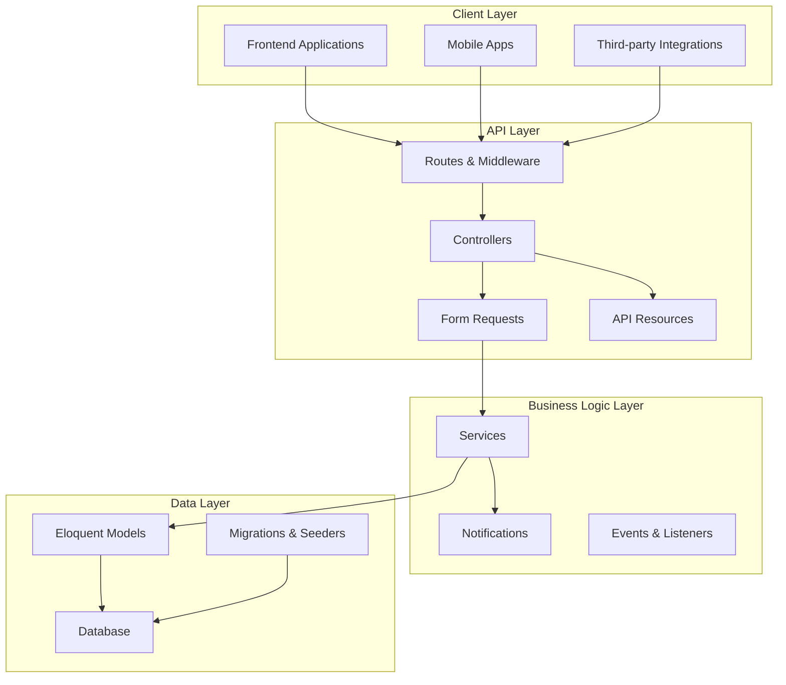
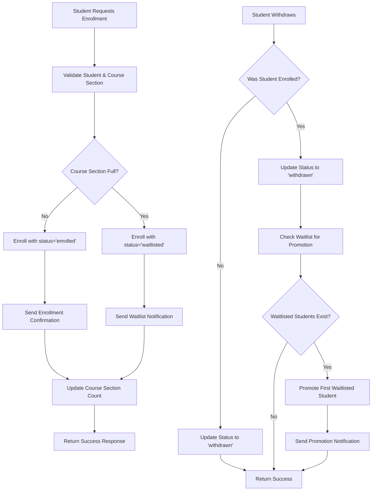
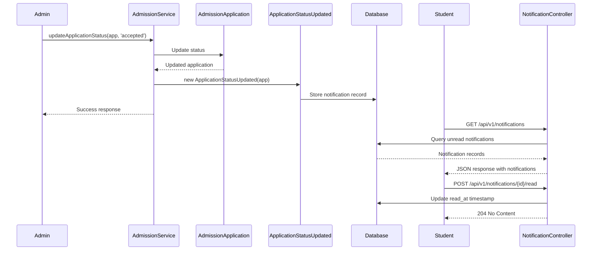

# University Admissions: Complete Backend Architecture Guide

This document serves as the definitive guide to the University Admissions backend system. It provides comprehensive coverage of the architecture, implementation details, business logic, and operational procedures needed to understand, maintain, and extend this professional-grade Laravel application.

---

## Table of Contents

1. [Executive Summary](#1-executive-summary)
2. [System Architecture Overview](#2-system-architecture-overview)
3. [Complete Data Model](#3-complete-data-model)
4. [Authentication & Authorization](#4-authentication--authorization)
5. [Complete API Reference](#5-complete-api-reference)
6. [Core Business Logic](#6-core-business-logic)
7. [JSON Transformation Layer](#7-json-transformation-layer)
8. [Error Handling & Validation](#8-error-handling--validation)
9. [Notification System](#9-notification-system)
10. [Testing Strategy](#10-testing-strategy)
11. [Developer Setup & Environment](#11-developer-setup--environment)
12. [Database Seeding & Sample Data](#12-database-seeding--sample-data)
13. [Performance & Scalability](#13-performance--scalability)
14. [Future Roadmap](#14-future-roadmap)

---

## 1. Executive Summary

### What This System Is
The University Admissions backend is a comprehensive RESTful API built with Laravel 11 that manages the complete lifecycle of university operations - from student admissions to course enrollment and academic management. It serves as the data and business logic layer for a modern university management system.

### Key Capabilities
- **Student Management**: Complete student profiles, academic records, and application tracking
- **Academic Structure**: Full university hierarchy (Faculties → Departments → Programs → Courses)
- **Course Management**: Course catalog, sections, scheduling, and enrollment
- **Staff Management**: Faculty and administrative staff with role-based permissions
- **Infrastructure**: Physical campus management (buildings, rooms, scheduling)
- **Notifications**: Real-time status updates and communication system
- **Security**: Token-based authentication with role-based access control

### Architectural Excellence
- **Clean Architecture**: Strict separation of concerns across layers
- **Scalable Design**: Built for growth with proper caching and optimization strategies
- **Developer Experience**: Comprehensive testing, clear documentation, and consistent patterns
- **Production Ready**: Robust error handling, security measures, and monitoring capabilities

---

## 2. System Architecture Overview

### Architectural Patterns

The system follows a layered architecture with clear separation of responsibilities:



### Request Lifecycle

Here's how a complex API request (student enrollment) flows through the system:

```mermaid
sequenceDiagram
    participant Client
    participant Router as Routes (api.php)
    participant Auth as Auth Middleware
    participant Controller as EnrollmentController
    participant FormRequest as StoreEnrollmentRequest
    participant Service as Business Logic
    participant Model as Eloquent Models
    participant Notifier as Notification System
    participant Resource as EnrollmentResource

    Client->>+Router: POST /api/v1/enrollments
    Note over Client,Router: Bearer Token in Header
    
    Router->>+Auth: Validate Token
    Auth-->>-Router: User Authenticated
    
    Router->>+Controller: store(StoreEnrollmentRequest)
    Controller->>+FormRequest: Auto-resolve & Validate
    
    alt Validation Fails
        FormRequest-->>Controller: 422 Validation Error
        Controller-->>Client: JSON Error Response
    else Validation Passes
        FormRequest-->>-Controller: Validated Data
        
        Controller->>+Service: Check Capacity & Business Rules
        Service->>+Model: Query Course Section
        Model-->>-Service: Section Data
        
        alt Course Full
            Service->>Model: Create with status='waitlisted'
        else Space Available
            Service->>Model: Create with status='enrolled'
        end
        
        Model-->>-Service: New Enrollment
        Service->>+Notifier: Send Status Notification
        Notifier-->>-Service: Notification Queued
        Service-->>-Controller: Enrollment Object
        
        Controller->>+Resource: Transform to JSON
        Resource-->>-Controller: Formatted Response
        Controller-->>-Client: 201 Created + JSON Data
    end
```

---

## 3. Complete Data Model

### Entity Relationship Diagram

This diagram shows all entities, their attributes, and relationships:

```mermaid
erDiagram
    USERS {
        bigint id PK
        string name
        string email UK
        timestamp email_verified_at
        string password
        string remember_token
        timestamps created_at_updated_at
    }

    ROLES {
        bigint id PK
        string name UK
        string guard_name
        timestamps created_at_updated_at
    }

    PERMISSIONS {
        bigint id PK
        string name UK
        string guard_name
        timestamps created_at_updated_at
    }

    STUDENTS {
        bigint id PK
        bigint user_id FK UK
        string student_number UK
        string first_name
        string last_name
        date date_of_birth
        string gender
        string nationality
        text address
        string city
        string state
        string postal_code
        string country
        string phone
        string emergency_contact_name
        string emergency_contact_phone
        timestamps created_at_updated_at
    }

    STAFF {
        bigint id PK
        bigint user_id FK UK
        bigint department_id FK
        string job_title
        string office_location
        string phone_number
        date hire_date
        timestamps created_at_updated_at
    }

    FACULTIES {
        bigint id PK
        string name
        timestamps created_at_updated_at
    }

    DEPARTMENTS {
        bigint id PK
        bigint faculty_id FK
        string name
        timestamps created_at_updated_at
    }

    PROGRAMS {
        bigint id PK
        bigint department_id FK
        string name
        text description
        string degree_type
        integer duration_years
        timestamps created_at_updated_at
    }

    COURSES {
        bigint id PK
        string course_code UK
        string title
        text description
        tinyint credits
        bigint department_id FK
        timestamps created_at_updated_at
    }

    COURSE_SECTIONS {
        bigint id PK
        bigint course_id FK
        bigint term_id FK
        bigint instructor_id FK
        bigint room_id FK
        string section_number
        smallint capacity
        string status
        json schedule_days
        time start_time
        time end_time
        timestamps created_at_updated_at
        unique course_id_term_id_section_number
    }

    TERMS {
        bigint id PK
        string name
        smallint academic_year
        string semester
        date start_date
        date end_date
        timestamps created_at_updated_at
        unique academic_year_semester
    }

    BUILDINGS {
        bigint id PK
        string name UK
        string address
        timestamps created_at_updated_at
    }

    ROOMS {
        bigint id PK
        bigint building_id FK
        string room_number
        smallint capacity
        enum type
        timestamps created_at_updated_at
        unique building_id_room_number
    }

    ADMISSION_APPLICATIONS {
        bigint id PK
        bigint student_id FK
        bigint term_id FK
        string status
        datetime application_date
        datetime decision_date
        string decision_status
        text comments
        timestamps created_at_updated_at
    }

    ENROLLMENTS {
        bigint id PK
        bigint student_id FK
        bigint course_section_id FK
        enum status
        string grade
        timestamps created_at_updated_at
        unique student_id_course_section_id
    }

    NOTIFICATIONS {
        uuid id PK
        string type
        string notifiable_type
        bigint notifiable_id
        text data
        timestamp read_at
        timestamps created_at_updated_at
        index notifiable_type_notifiable_id
    }

    ACADEMIC_RECORDS {
        bigint id PK
        bigint student_id FK
        string institution_name
        string degree_type
        string field_of_study
        date graduation_date
        decimal gpa
        timestamps created_at_updated_at
    }

    DOCUMENTS {
        bigint id PK
        bigint student_id FK
        string document_type
        string file_path
        string original_filename
        string mime_type
        bigint file_size
        string status
        timestamps created_at_updated_at
    }

    %% Relationships
    USERS ||--o{ STUDENTS : "has one"
    USERS ||--o{ STAFF : "has one"
    USERS ||--o{ ROLES : "many-to-many"
    ROLES ||--o{ PERMISSIONS : "many-to-many"
    USERS ||--o{ NOTIFICATIONS : "morphMany"

    STUDENTS ||--o{ ADMISSION_APPLICATIONS : "has many"
    STUDENTS ||--o{ ENROLLMENTS : "has many"
    STUDENTS ||--o{ ACADEMIC_RECORDS : "has many"
    STUDENTS ||--o{ DOCUMENTS : "has many"

    FACULTIES ||--o{ DEPARTMENTS : "has many"
    DEPARTMENTS ||--o{ PROGRAMS : "has many"
    DEPARTMENTS ||--o{ COURSES : "has many"
    DEPARTMENTS ||--o{ STAFF : "has many"

    STAFF ||--o{ COURSE_SECTIONS : "instructs"

    COURSES ||--o{ COURSE_SECTIONS : "has many"
    COURSES ||--o{ COURSES : "prerequisites"

    TERMS ||--o{ COURSE_SECTIONS : "has many"
    TERMS ||--o{ ADMISSION_APPLICATIONS : "has many"

    BUILDINGS ||--o{ ROOMS : "has many"
    ROOMS ||--o{ COURSE_SECTIONS : "hosts"

    COURSE_SECTIONS ||--o{ ENROLLMENTS : "has many"
```

### Key Model Relationships Explained

**User-Centric Design**: The `User` model serves as the authentication hub, with `Student` and `Staff` models extending user capabilities through one-to-one relationships.

**Academic Hierarchy**: `Faculty` → `Department` → `Program`/`Course` creates a logical academic structure that mirrors real university organization.

**Course Scheduling**: `Course` (catalog) → `CourseSection` (specific offering) → `Enrollment` (student registration) enables flexible scheduling and capacity management.

**Physical Infrastructure**: `Building` → `Room` → `CourseSection` links academic scheduling with physical space management.

---

## 4. Authentication & Authorization

### Token-Based Authentication (Laravel Sanctum)

The system uses Laravel Sanctum for stateless API authentication:

```php
// AuthController@login - Token Creation
public function login(Request $request)
{
    $request->validate([
        'email' => 'required|email',
        'password' => 'required',
        'device_name' => 'required',
    ]);

    $user = User::where('email', $request->email)->first();

    if (! $user || ! Hash::check($request->password, $user->password)) {
        throw ValidationException::withMessages([
            'email' => ['The provided credentials are not correct.'],
        ]);
    }

    return response()->json([
        'token' => $user->createToken($request->device_name)->plainTextToken
    ]);
}
```

### Authentication Flow

1. **Token Creation**: `POST /api/v1/tokens/create` with email/password/device_name
2. **Token Usage**: Include `Authorization: Bearer {token}` header in all API requests
3. **Token Validation**: `auth:sanctum` middleware validates tokens automatically
4. **User Context**: `$request->user()` provides authenticated user in controllers

### Role-Based Access Control (RBAC)

The system implements a flexible RBAC system:

**Models**:
- `Role`: Defines user roles (admin, student, faculty, staff)
- `Permission`: Defines specific permissions (view-applications, edit-courses)
- `User`: Links to roles via many-to-many relationship

**Usage Example**:
```php
// Check if user has specific permission
if ($user->hasPermissionTo('edit-applications')) {
    // Allow action
}

// Check if user has role
if ($user->hasRole('admin')) {
    // Admin-only functionality
}
```

---

## 5. Complete API Reference

### Authentication Endpoints

| Method | URI | Controller | Description |
|--------|-----|------------|-------------|
| POST | `/api/v1/tokens/create` | AuthController@login | Create authentication token |

### Core Resource Endpoints

All endpoints below require `Authorization: Bearer {token}` header.

| Method | URI | Controller | Description |
|--------|-----|------------|-------------|
| GET | `/api/v1/faculties` | FacultyController@index | List all faculties |
| POST | `/api/v1/faculties` | FacultyController@store | Create new faculty |
| GET | `/api/v1/faculties/{id}` | FacultyController@show | Get specific faculty |
| PUT | `/api/v1/faculties/{id}` | FacultyController@update | Update faculty |
| DELETE | `/api/v1/faculties/{id}` | FacultyController@destroy | Delete faculty |
| GET | `/api/v1/departments` | DepartmentController@index | List departments (filterable by faculty) |
| POST | `/api/v1/departments` | DepartmentController@store | Create new department |
| GET | `/api/v1/departments/{id}` | DepartmentController@show | Get specific department |
| PUT | `/api/v1/departments/{id}` | DepartmentController@update | Update department |
| DELETE | `/api/v1/departments/{id}` | DepartmentController@destroy | Delete department |
| GET | `/api/v1/programs` | ProgramController@index | List programs (filterable by department) |
| POST | `/api/v1/programs` | ProgramController@store | Create new program |
| GET | `/api/v1/programs/{id}` | ProgramController@show | Get specific program |
| PUT | `/api/v1/programs/{id}` | ProgramController@update | Update program |
| DELETE | `/api/v1/programs/{id}` | ProgramController@destroy | Delete program |
| GET | `/api/v1/courses` | CourseController@index | List courses (filterable by department) |
| POST | `/api/v1/courses` | CourseController@store | Create new course |
| GET | `/api/v1/courses/{id}` | CourseController@show | Get specific course |
| PUT | `/api/v1/courses/{id}` | CourseController@update | Update course |
| DELETE | `/api/v1/courses/{id}` | CourseController@destroy | Delete course |
| GET | `/api/v1/staff` | StaffController@index | List staff (filterable by department) |
| POST | `/api/v1/staff` | StaffController@store | Create new staff member |
| GET | `/api/v1/staff/{id}` | StaffController@show | Get specific staff member |
| PUT | `/api/v1/staff/{id}` | StaffController@update | Update staff member |
| DELETE | `/api/v1/staff/{id}` | StaffController@destroy | Delete staff member |
| GET | `/api/v1/terms` | TermController@index | List academic terms |
| POST | `/api/v1/terms` | TermController@store | Create new term |
| GET | `/api/v1/terms/{id}` | TermController@show | Get specific term |
| PUT | `/api/v1/terms/{id}` | TermController@update | Update term |
| DELETE | `/api/v1/terms/{id}` | TermController@destroy | Delete term |
| GET | `/api/v1/buildings` | BuildingController@index | List buildings |
| POST | `/api/v1/buildings` | BuildingController@store | Create new building |
| GET | `/api/v1/buildings/{id}` | BuildingController@show | Get specific building |
| PUT | `/api/v1/buildings/{id}` | BuildingController@update | Update building |
| DELETE | `/api/v1/buildings/{id}` | BuildingController@destroy | Delete building |
| GET | `/api/v1/rooms` | RoomController@index | List rooms (filterable by building) |
| POST | `/api/v1/rooms` | RoomController@store | Create new room |
| GET | `/api/v1/rooms/{id}` | RoomController@show | Get specific room |
| PUT | `/api/v1/rooms/{id}` | RoomController@update | Update room |
| DELETE | `/api/v1/rooms/{id}` | RoomController@destroy | Delete room |

### Course Section Endpoints

| Method | URI | Controller | Description |
|--------|-----|------------|-------------|
| GET | `/api/v1/course-sections` | CourseSectionController@index | List course sections (filterable) |
| POST | `/api/v1/course-sections` | CourseSectionController@store | Create new course section |
| GET | `/api/v1/course-sections/{id}` | CourseSectionController@show | Get specific course section |
| PUT | `/api/v1/course-sections/{id}` | CourseSectionController@update | Update course section |
| DELETE | `/api/v1/course-sections/{id}` | CourseSectionController@destroy | Delete course section |

### Enrollment Endpoints (Complex Business Logic)

| Method | URI | Controller | Description |
|--------|-----|------------|-------------|
| GET | `/api/v1/enrollments` | EnrollmentController@index | List enrollments (extensive filtering) |
| POST | `/api/v1/enrollments` | EnrollmentController@store | Enroll student (capacity/waitlist logic) |
| GET | `/api/v1/enrollments/{id}` | EnrollmentController@show | Get specific enrollment |
| PUT | `/api/v1/enrollments/{id}` | EnrollmentController@update | Update enrollment status/grade |
| DELETE | `/api/v1/enrollments/{id}` | EnrollmentController@destroy | Withdraw enrollment |
| POST | `/api/v1/enrollments/{id}/withdraw` | EnrollmentController@withdraw | Withdraw student from course |
| POST | `/api/v1/enrollments/{id}/complete` | EnrollmentController@complete | Mark enrollment complete with grade |
| GET | `/api/v1/students/{id}/enrollments` | EnrollmentController@byStudent | Get all enrollments for student |
| GET | `/api/v1/course-sections/{id}/enrollments` | EnrollmentController@byCourseSection | Get all enrollments for section |

### Notification Endpoints

| Method | URI | Controller | Description |
|--------|-----|------------|-------------|
| GET | `/api/v1/notifications` | NotificationController@index | Get unread notifications for user |
| POST | `/api/v1/notifications/{id}/read` | NotificationController@markAsRead | Mark notification as read |

### Student Profile Endpoint

| Method | URI | Controller | Description |
|--------|-----|------------|-------------|
| GET | `/api/students/{id}` | StudentController@showApi | Get student profile with relationships |

---

## 6. Core Business Logic

### Student Enrollment System

The enrollment system is the most complex business logic component, handling course capacity, waitlists, and status transitions.

#### Enrollment Process Flow



#### Key Business Rules

**Capacity Management**:
```php
// From StoreEnrollmentRequest validation
public function withValidator($validator)
{
    $validator->after(function ($validator) {
        $courseSection = CourseSection::find($this->course_section_id);
        $enrolledCount = $courseSection->enrollments()
            ->where('status', 'enrolled')->count();
        
        if ($enrolledCount >= $courseSection->capacity) {
            // Will be waitlisted
            $this->merge(['status' => 'waitlisted']);
        } else {
            $this->merge(['status' => 'enrolled']);
        }
    });
}
```

**Waitlist Promotion**:
```php
// From EnrollmentController
private function promoteFromWaitlist(CourseSection $courseSection): void
{
    $enrolledCount = $courseSection->enrollments()
        ->where('status', 'enrolled')->count();
    
    if ($enrolledCount < $courseSection->capacity) {
        $waitlistedEnrollment = $courseSection->enrollments()
            ->where('status', 'waitlisted')
            ->orderBy('created_at')
            ->first();
        
        if ($waitlistedEnrollment) {
            $waitlistedEnrollment->update(['status' => 'enrolled']);
            // Send notification to promoted student
        }
    }
}
```

### Application Status Management

The `AdmissionService` handles application lifecycle and notifications:

```php
public function updateApplicationStatus(AdmissionApplication $application, string $newStatus): AdmissionApplication
{
    $oldStatus = $application->status;
    
    // Update the application status
    $application->update(['status' => $newStatus]);
    
    // Only send notification if status actually changed
    if ($oldStatus !== $newStatus) {
        // Dispatch notification to the student's user
        $application->student->user->notify(new ApplicationStatusUpdated($application));
        
        Log::info("Application {$application->id} status updated from {$oldStatus} to {$newStatus}. Notification sent to user {$application->student->user->id}.");
    }
    
    return $application;
}
```

---

## 7. JSON Transformation Layer

### API Resources Overview

API Resources provide a transformation layer between Eloquent models and JSON responses, ensuring consistent output and preventing data leakage.

### Example: EnrollmentResource

**Raw Eloquent Model** (what we DON'T want to expose):
```php
Enrollment {
  id: 1,
  student_id: 5,
  course_section_id: 12,
  status: "enrolled",
  grade: null,
  created_at: "2024-01-15 10:30:00",
  updated_at: "2024-01-15 10:30:00",
  // Raw foreign key IDs, timestamps, etc.
}
```

**Transformed API Response** (clean, structured JSON):
```json
{
  "data": {
    "id": 1,
    "status": "enrolled",
    "grade": null,
    "enrolled_at": "2024-01-15T10:30:00.000Z",
    "updated_at": "2024-01-15T10:30:00.000Z",
    "student": {
      "id": 5,
      "student_number": "STU001",
      "name": "John Doe",
      "email": "john.doe@university.edu"
    },
    "course_section": {
      "id": 12,
      "section_number": "001",
      "capacity": 30,
      "enrolled_count": 25,
      "available_spots": 5,
      "schedule_display": "MWF 9:00 AM-10:00 AM",
      "course": {
        "id": 8,
        "course_code": "CS101",
        "title": "Introduction to Computer Science",
        "credits": 3
      },
      "term": {
        "id": 3,
        "name": "Fall 2024",
        "academic_year": 2024,
        "semester": "Fall"
      },
      "instructor": {
        "id": 2,
        "name": "Dr. Smith",
        "job_title": "Professor"
      },
      "room": {
        "id": 15,
        "room_number": "101",
        "building": {
          "name": "Science Building"
        }
      }
    }
  }
}
```

### Key Resource Features

**Conditional Loading**: Resources only include relationships when they're explicitly loaded:
```php
'student' => $this->whenLoaded('student', function () {
    return [
        'id' => $this->student->id,
        'student_number' => $this->student->student_number,
        'name' => $this->student->first_name . ' ' . $this->student->last_name,
    ];
})
```

**Computed Fields**: Resources can add calculated values:
```php
'available_spots' => max(0, $courseSection->capacity - $enrolledCount),
'schedule_display' => $this->formatScheduleDisplay($courseSection)
```

**Data Protection**: Sensitive fields are never accidentally exposed since only explicitly defined fields are included.

---

## 8. Error Handling & Validation

### Centralized Error Handling

All API errors return consistent JSON responses via `bootstrap/app.php`:

```php
$exceptions->render(function (Throwable $e, Illuminate\Http\Request $request) {
    if ($request->is('api/*')) {
        $message = 'An unexpected error occurred.';
        $statusCode = 500;
        $errors = [];

        if ($e instanceof Symfony\Component\HttpKernel\Exception\NotFoundHttpException) {
            $message = 'The requested resource was not found.';
            $statusCode = 404;
        } elseif ($e instanceof Illuminate\Auth\AuthenticationException) {
            $message = 'Unauthenticated.';
            $statusCode = 401;
        } elseif ($e instanceof Illuminate\Auth\Access\AuthorizationException) {
            $message = 'This action is unauthorized.';
            $statusCode = 403;
        } elseif ($e instanceof Illuminate\Validation\ValidationException) {
            $message = 'The given data was invalid.';
            $statusCode = 422;
            $errors = $e->errors();
        }

        $response = ['message' => $message];
        if (!empty($errors)) {
            $response['errors'] = $errors;
        }

        return response()->json($response, $statusCode);
    }
});
```

### Standard Error Responses

**404 Not Found**:
```json
{
  "message": "The requested resource was not found."
}
```

**401 Unauthenticated**:
```json
{
  "message": "Unauthenticated."
}
```

**422 Validation Error**:
```json
{
  "message": "The given data was invalid.",
  "errors": {
    "email": ["The email field is required."],
    "course_section_id": ["The selected course section is invalid."]
  }
}
```

### Form Request Validation

Validation logic is centralized in Form Request classes:

```php
// StoreEnrollmentRequest
public function rules(): array
{
    return [
        'student_id' => 'required|exists:students,id',
        'course_section_id' => 'required|exists:course_sections,id',
    ];
}

public function withValidator($validator)
{
    $validator->after(function ($validator) {
        // Custom business logic validation
        if ($this->duplicateEnrollmentExists()) {
            $validator->errors()->add('course_section_id', 
                'Student is already enrolled in this course section.');
        }
    });
}
```

---

## 9. Notification System

### Database-Driven Notifications

The system uses Laravel's notification system with database storage for persistent, queryable notifications.

### Notification Flow



### Notification Structure

**ApplicationStatusUpdated Notification**:
```php
public function toDatabase($notifiable): array
{
    return [
        'application_id' => $this->application->id,
        'status' => $this->application->status,
        'message' => "Your application status has been updated to: {$this->application->status}",
    ];
}
```

**Database Record**:
```json
{
  "id": "uuid-string",
  "type": "App\\Notifications\\ApplicationStatusUpdated",
  "notifiable_type": "App\\Models\\User",
  "notifiable_id": 5,
  "data": {
    "application_id": 12,
    "status": "accepted",
    "message": "Your application status has been updated to: accepted"
  },
  "read_at": null,
  "created_at": "2024-01-15T10:30:00.000Z"
}
```

---

## 10. Testing Strategy

### Feature Test Coverage

The system emphasizes comprehensive feature tests that verify complete API workflows:

**Test Categories**:
- **Authentication Tests**: Token creation, validation, error handling
- **CRUD Tests**: Create, read, update, delete operations for all resources
- **Business Logic Tests**: Enrollment capacity, waitlist promotion, status transitions
- **Authorization Tests**: Role-based access control, data isolation
- **Error Handling Tests**: Validation errors, not found, unauthorized access

### Example Test Structure

```php
// tests/Feature/Api/V1/EnrollmentApiTest.php
class EnrollmentApiTest extends TestCase
{
    use RefreshDatabase;

    public function test_can_enroll_student_with_available_capacity()
    {
        $student = Student::factory()->create();
        $courseSection = CourseSection::factory()->create(['capacity' => 30]);
        
        $response = $this->actingAs($student->user, 'sanctum')
            ->postJson('/api/v1/enrollments', [
                'student_id' => $student->id,
                'course_section_id' => $courseSection->id,
            ]);

        $response->assertStatus(201)
            ->assertJson([
                'message' => 'Student has been successfully enrolled in the course section.',
                'data' => [
                    'status' => 'enrolled',
                    'student' => ['id' => $student->id],
                    'course_section' => ['id' => $courseSection->id]
                ]
            ]);

        $this->assertDatabaseHas('enrollments', [
            'student_id' => $student->id,
            'course_section_id' => $courseSection->id,
            'status' => 'enrolled'
        ]);
    }
}
```

### Test Database Management

Tests use SQLite in-memory database with `RefreshDatabase` trait for fast, isolated test execution.

---

## 11. Developer Setup & Environment

### Prerequisites

- PHP 8.2+
- Composer
- Node.js & NPM (for frontend assets)
- SQLite (for testing) or MySQL/PostgreSQL (for development)

### Initial Setup

```bash
# 1. Clone the repository
git clone <repository-url>
cd university-admissions

# 2. Install PHP dependencies
composer install

# 3. Install Node dependencies
npm install

# 4. Environment configuration
cp .env.example .env
php artisan key:generate

# 5. Database setup
# Edit .env file with your database credentials
# For SQLite (simplest):
touch database/database.sqlite
# Update .env: DB_CONNECTION=sqlite, DB_DATABASE=/absolute/path/to/database.sqlite

# 6. Run migrations and seed data
php artisan migrate --seed

# 7. Generate application key and storage link
php artisan storage:link

# 8. Start development server
php artisan serve
```

### Environment Variables

Key `.env` configurations:

```env
APP_NAME="University Admissions"
APP_ENV=local
APP_DEBUG=true
APP_URL=http://localhost:8000

DB_CONNECTION=sqlite
DB_DATABASE=/absolute/path/to/database.sqlite

# For MySQL/PostgreSQL:
# DB_CONNECTION=mysql
# DB_HOST=127.0.0.1
# DB_PORT=3306
# DB_DATABASE=university_admissions
# DB_USERNAME=root
# DB_PASSWORD=

SANCTUM_STATEFUL_DOMAINS=localhost,127.0.0.1
```

### Development Workflow

```bash
# Run tests
php artisan test

# Run specific test file
php artisan test tests/Feature/Api/V1/EnrollmentApiTest.php

# Generate API documentation (if Scribe is installed)
php artisan scribe:generate

# Clear caches during development
php artisan config:clear
php artisan route:clear
php artisan view:clear

# Database operations
php artisan migrate:fresh --seed  # Reset and reseed database
php artisan db:seed --class=AcademicHierarchySeeder  # Run specific seeder
```

---

## 12. Database Seeding & Sample Data

### Available Seeders

The system includes comprehensive seeders for development and testing:

| Seeder | Purpose | Dependencies |
|--------|---------|--------------|
| `UserSeeder` | Creates admin and test users | None |
| `RolePermissionSeeder` | Sets up RBAC system | UserSeeder |
| `AcademicHierarchySeeder` | Creates faculties, departments, programs | None |
| `StudentSeeder` | Creates sample students | UserSeeder |
| `AdmissionApplicationSeeder` | Creates sample applications | StudentSeeder, AcademicHierarchySeeder |
| `ScribeDocumentationSeeder` | Creates data for API docs | All others |

### Seeding Process

```bash
# Seed everything (recommended for fresh setup)
php artisan migrate:fresh --seed

# Seed specific components
php artisan db:seed --class=AcademicHierarchySeeder
php artisan db:seed --class=StudentSeeder
```

### Sample Data Structure

**Academic Hierarchy** (from `AcademicHierarchySeeder`):
- 4 Faculties (Arts & Science, Engineering, Business, Medicine)
- 12+ Departments across faculties
- 20+ Programs with realistic degree types
- 50+ Courses with prerequisites

**Users & Authentication**:
- Admin user: `admin@university.edu` / `password`
- Sample students with complete profiles
- Staff members linked to departments

**Infrastructure**:
- Multiple buildings with rooms
- Course sections with realistic scheduling
- Terms for multiple academic years

---

## 13. Performance & Scalability

### Current Optimizations

**Database Optimizations**:
- Proper indexing on foreign keys and frequently queried fields
- Eager loading to prevent N+1 queries
- Pagination on all list endpoints

**API Optimizations**:
- Conditional relationship loading in API Resources
- Efficient filtering with database-level WHERE clauses
- Standardized pagination with metadata

### Recommended Enhancements

**Caching Strategy**:
```php
// Example: Cache faculty list (rarely changes)
$faculties = Cache::remember('faculties.all', 3600, function () {
    return Faculty::with('departments')->get();
});
```

**Database Indexing**:
```sql
-- Recommended additional indexes
CREATE INDEX idx_enrollments_status ON enrollments(status);
CREATE INDEX idx_course_sections_term_course ON course_sections(term_id, course_id);
CREATE INDEX idx_notifications_notifiable ON notifications(notifiable_type, notifiable_id, read_at);
```

**Queue System**:
```php
// Move notifications to queues for better performance
$application->student->user->notify(new ApplicationStatusUpdated($application));
// Should become:
dispatch(new SendApplicationNotification($application, $newStatus));
```

---

## 14. Future Roadmap

### Immediate Improvements (Next Sprint)

1. **Fix Remaining Test Failures**: Address pre-existing test issues in `BuildingApiTest`, `CourseSectionApiTest`, etc.
2. **API Documentation**: Complete Scribe documentation for all endpoints
3. **Performance Monitoring**: Implement query logging and performance metrics

### Short-term Enhancements (1-2 Months)

1. **File Upload System**: Document management for student applications
2. **Advanced Reporting**: Analytics dashboard for admissions and enrollment data
3. **Email Notifications**: Extend notification system to include email delivery
4. **API Rate Limiting**: Implement throttling for production security

### Medium-term Features (3-6 Months)

1. **Frontend Application**: Vue.js or React SPA consuming the API
2. **Mobile API**: Optimized endpoints for mobile applications
3. **Integration APIs**: Third-party system integrations (payment, LMS)
4. **Advanced Search**: Elasticsearch integration for complex queries

### Long-term Vision (6+ Months)

1. **Microservices Architecture**: Split into domain-specific services
2. **Real-time Features**: WebSocket integration for live updates
3. **Machine Learning**: Predictive analytics for admissions and enrollment
4. **Multi-tenant Support**: Support multiple universities/institutions

---

## Conclusion

This University Admissions backend represents a mature, production-ready API that successfully balances complexity with maintainability. The architecture demonstrates professional Laravel development practices and provides a solid foundation for a comprehensive university management system.

The system's strength lies in its clear separation of concerns, comprehensive test coverage, and thoughtful business logic implementation. It serves as an excellent example of how to build scalable, maintainable APIs that can grow with organizational needs.

For developers joining this project, this document provides the complete context needed to understand, maintain, and extend the system effectively. The combination of clear architecture, comprehensive documentation, and robust testing makes this codebase a pleasure to work with and a strong foundation for future development. 